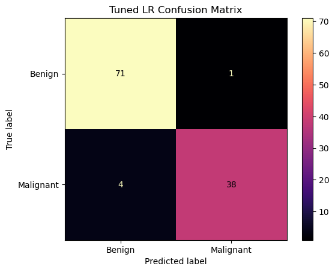

# Breast Cancer Classification Using Machine Learning

Classifying breast tumors as **benign (0)** or **malignant (1)** from 30 diagnostic measurements, and comparing four machine learning models before and after hyperparameter tuning.

> **Educational purposes only.** These models must not be used for medical diagnosis or decisions.

## Dataset

569 samples and 30 numeric features: 357 benign and 212 malignant. The `id` and `Unnamed: 32` columns were dropped.

## Results

| Model               | Cross-validation accuracy | Test accuracy |
| ------------------- | ------------------------: | ------------: |
| **Logistic Regression** |                **98.68%** |    **95.61%** |
| SVM                 |                    98.24% |        93.86% |
| Random Forest       |                    96.48% |        92.98% |
| Decision Tree       |                    94.95% |        89.47% |

Cross-validation scores come from 5-fold `GridSearchCV` on the training set. Test scores come from the held-out 20% (114 samples).

The tuned Logistic Regression model (`C=0.1`, `solver="liblinear"`) scored highest:

| Class     | Precision | Recall | F1-score |
| --------- | --------: | -----: | -------: |
| Benign    |      0.95 |   0.99 |     0.97 |
| Malignant |      0.97 |   0.90 |     0.94 |



**Takeaways**
- Logistic Regression and SVM were close: the gap on the test set is only 2 cases out of 114, so a different split could change the ranking.
- The model missed 4 of 42 malignant tumors (recall 0.90). In a medical setting, missed malignant cases are the costliest error, so this is the first thing to improve.
- Tuning didn't always help on the test set. Random Forest scored slightly lower after tuning (93.86% to 92.98%).

## Approach

1. Loaded the data with Pandas and dropped unused columns
2. Encoded `diagnosis` (`B` = 0, `M` = 1)
3. Split 80/20 with `random_state=40` and `stratify=y`
4. Standardized features with `StandardScaler` (used for Logistic Regression and SVM)
5. Trained Logistic Regression, Decision Tree, Random Forest and SVM
6. Tuned each with `GridSearchCV` (5-fold, accuracy scoring)
7. Compared models with accuracy, precision, recall, F1-score and confusion matrices

## How to Run

```bash
git clone https://github.com/salamatsaheed-ux/breast-cancer-classification.git
cd breast-cancer-classification
pip install -r requirements.txt
jupyter notebook breast-cancer-classification.ipynb
```

## Tech Stack

Python · Jupyter Notebook · Pandas · NumPy · Matplotlib · Scikit-learn

## Project Structure

```text
breast-cancer-classification/
├── data/
│   └── breast_cancer_data.csv
├── images/
├── breast-cancer-classification.ipynb
├── README.md
├── requirements.txt
└── .gitignore
```

## Author

**Salamat Saheed**: built as part of my machine learning journey.
